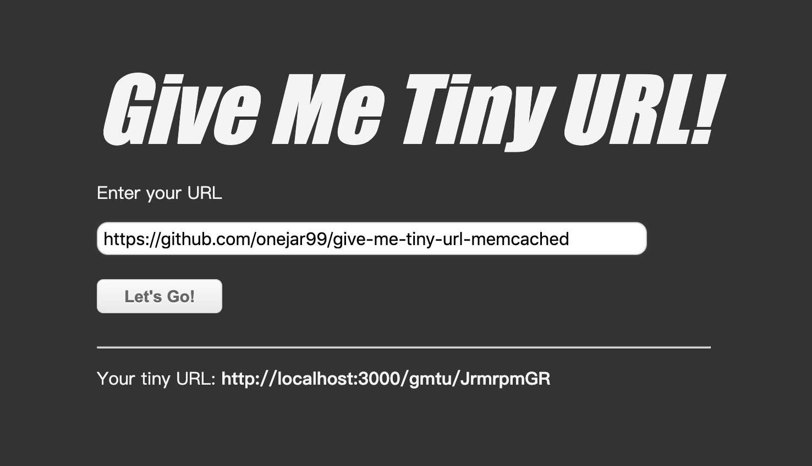
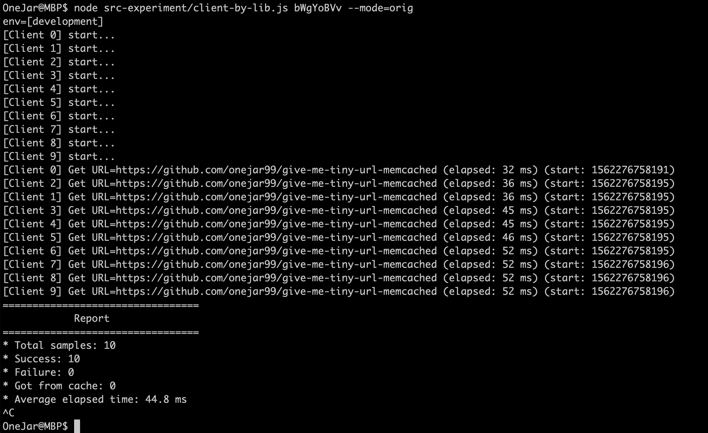
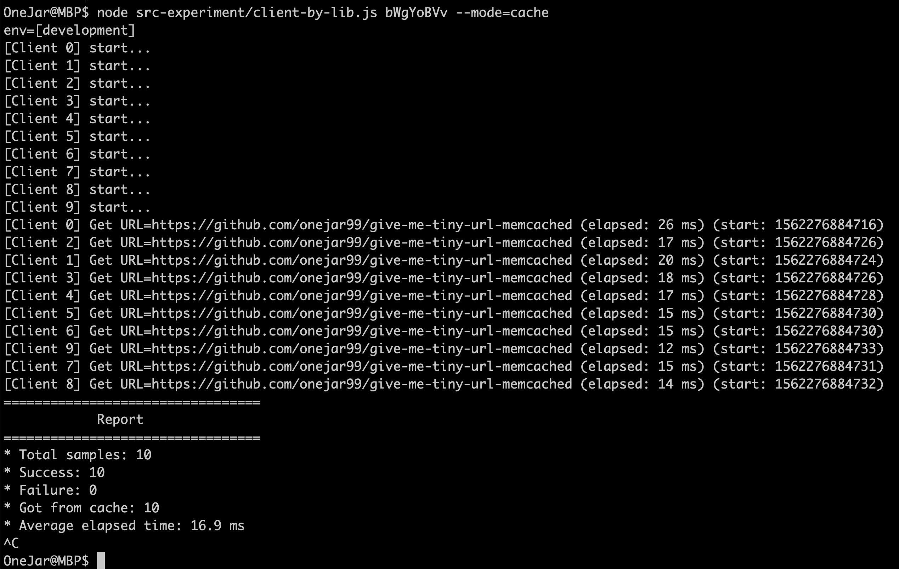

GMTU - Give Me Tiny URL
========================

Intro
--------
* A simple project for memcached demo.

Tech Stack
--------
* Node.js + Express + MongoDB
* Memory Cache: memcached

Usage
--------
| Type       | URL                             |                                           |
| ---------- | ------------------------------- | ----------------------------------------- |
| View Page  | /gmtu                           | Main GUI for this applicaiotn             |
| View Page  | /gmtu/{hashCode}                | Direct shorten urls to real websites      |
| API        | POST /tinyUrl                   | Create a shorten url                      |
| API        | GET /tinyUrl/{hashCode}         | Query url by shorten code                 |
| API        | GET /tinyUrlCached/{hashCode}   | Query url by shorten code (with cache)    |

Experiment
--------

### Commands:

* Call by libraries:
    - `$ node src-experiment/client-by-lib.js bWgYoBVv --mode=orig`
    - `$ node src-experiment/client-by-lib.js bWgYoBVv --mode=cache`
* Call by Web APIs:
    - `$ node src-experiment/client-by-lib.js bWgYoBVv --mode=orig`
    - `$ node src-experiment/client-by-lib.js bWgYoBVv --mode=cache`

### Experiment Results:

* Memory cache can improve over 50% performace.

* `$ node src-experiment/client-by-lib.js bWgYoBVv --mode=orig`

* `$ node src-experiment/client-by-lib.js bWgYoBVv --mode=cache`

